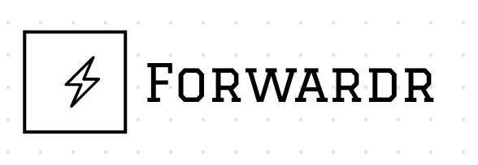
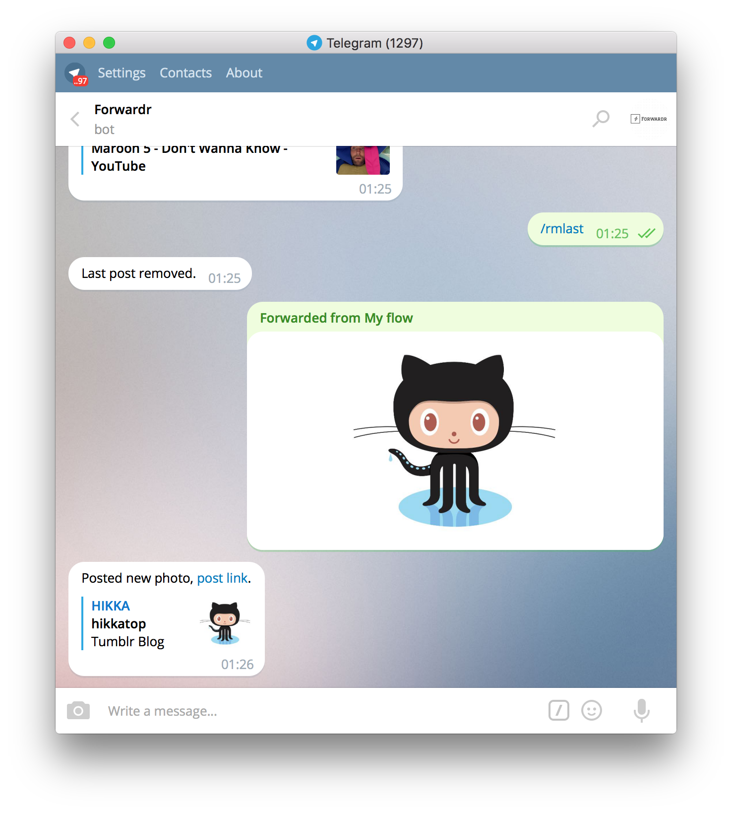

<h3 align="center">
  
</h3>

# Forwardr

#### Simple to use Telegram-to-Tumblr bot

## Usage

You can use existing bot [@ForwardrBot](https://telegram.me/forwardrbot) or run your own.

To start the bot:
- Register your bot. Talk to [BotFather](https://telegram.me/botfather) and generate an authorization token.
- Register Tumblr app. Go to [Tumblr Apps page](https://www.tumblr.com/oauth/apps), create new app and get `OAuth Consumer Key` and `Secret Key`
- Clone repository `git clone https://github.com/pashutk/forwardr.git && cd forwardr`
- Install dependencies `npm install`
- Run bot `npm start` and don't forget to specify tokens with environment variables or config file (see [section below](#variables))

### Variables

To run your bot you need to specify bot token, tumblr app consumer key and secret key (and optionally oauth redirect host for
oauth authentification callback). You can set keys with [Environment variables](https://en.wikipedia.org/wiki/Environment_variable) or write them to `config.json` file. In case of using config file, use `config_example.json` as an example.

List of keys:
- `FORWARDR_TELEGRAM_BOT_TOKEN`
- `FORWARDR_TUMBLR_CONSUMER_KEY`
- `FORWARDR_TUMBLR_CONSUMER_SECRET`
- `FORWARDR_SERVER_AUTH_HOST` (default is `http://localhost`)

Also you can set `FORWARDR_SERVER_PORT` key to specify application port.

## Screenshot

<h3 align="center">
  
</h3>

## Contacts

Feel free to contact me at [telegram](https://telegram.me/pashutk) or [twitter](https://twitter.com/pashutk)
